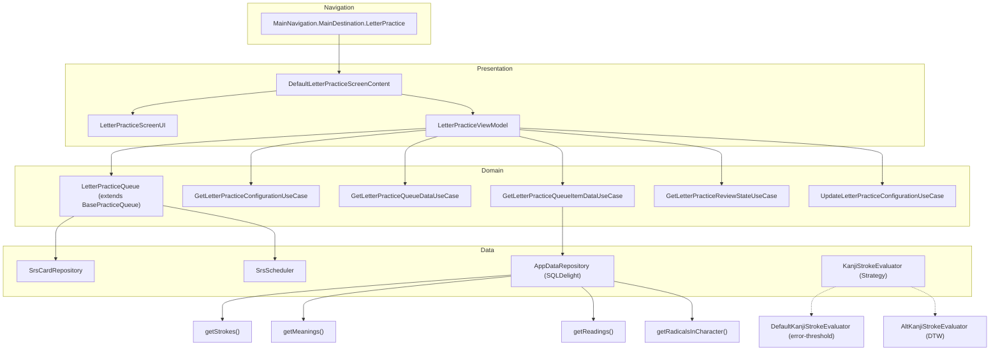

# Architecture Overview: Writing Kanji Module

## High-Level Architecture
The Writing Kanji module is structured according to Clean Architecture principles, ensuring separation of concerns and maintainability. The architecture consists of 4 main layers:
1. **Navigation**: Handles routing and passing arguments to the module.
2. **Presentation (ViewModel)**: Manages UI state, observes the practice queue, and handles user interactions.
3. **Domain (Use Cases)**: Encapsulates business logic, including fetching data, calculating practice configurations, and setting up review sessions.
4. **Data (Repository/DB)**: Retrieves data from local storage (SQLDelight) and performs evaluations.

### Design Patterns
- **MVVM (Model-View-ViewModel)**: Separates the UI from business logic.
- **Repository Pattern**: Abstracts data sources (e.g., `AppDataRepository`, `SrsCardRepository`).
- **Use Case Pattern**: Isolates specific business operations into single-responsibility classes.
- **State Machine**: Used for managing screen states (Loading, Configuring, Review, Summary) and writer states.
- **Observer (StateFlow)**: Facilitates reactive UI updates from the ViewModel.
- **Strategy (StrokeEvaluator)**: Allows different stroke evaluation algorithms (e.g., `DefaultKanjiStrokeEvaluator` vs `AltKanjiStrokeEvaluator`).
- **Dependency Injection**: Koin is used to provide dependencies across all layers.

## Layer Diagram


## Module Boundaries
The Writing Kanji module is tightly integrated with the overall practice system but maintains specific boundaries:
- **`practice_letter`**: This package contains the entry points and specifics for letter (character) practice. It shares code seamlessly between writing practice and reading practice (e.g., the queue logic handles both types).
- **`practice_common`**: A shared module that provides foundational components for writing practice across different contexts (e.g., vocab writing). This includes the core `CharacterWriter`, grid decorations, and base practice queue functionality.

## File Structure

### Module Specific (`practice_letter/`)
```text
practice_letter/
├── DefaultLetterPracticeScreenContent.kt  # Screen entry, wires navigation callbacks
├── LetterPracticeScreenContract.kt        # Contract interface: Content, ViewModel, ScreenState
├── LetterPracticeViewModel.kt             # ViewModel: state management, queue observation
├── LetterPracticeQueue.kt                 # Queue implementation extending BasePracticeQueue
├── LetterPracticeScreenModule.kt          # Koin DI wiring
├── data/
│   ├── LetterPracticeScreenData.kt        # Configurations and modes
│   └── LetterPracticeQueueData.kt         # Queue state and items
├── ui/
│   ├── LetterPracticeScreenUI.kt          # Main screen with state routing
│   ├── LetterPracticeWritingUI.kt         # Writing review layout (portrait/landscape)
│   ├── LetterPracticeWritingInfoSection.kt    # Character info: readings, meanings, radicals
│   ├── LetterPracticeWritingInputSection.kt   # Drawing canvas wrapper with CharacterWriter
│   ├── LetterPracticeWritingWordsBottomSheet.kt # Example words bottom sheet
│   └── LetterPracticeReadingUI.kt         # Reading mode (sibling)
└── use_case/
    ├── GetLetterPracticeConfigurationUseCase.kt    # Loads preferences, determines new/review cards
    ├── GetLetterPracticeQueueDataUseCase.kt        # Builds queue descriptors with layout config
    ├── GetLetterPracticeQueueItemDataUseCase.kt    # Loads strokes, readings, meanings, examples from DB
    ├── GetLetterPracticeReviewStateUseCase.kt      # Creates WriterState instances for study/review
    └── UpdateLetterPracticeConfigurationUseCase.kt # Persists user preferences
```

### Shared Components (`practice_common/`)
```text
practice_common/
├── CharacterWriter.kt             # Core canvas composable
├── CharacterWriterState.kt        # State machine (SingleStroke, MultipleStroke, Animation)
├── CharacterWriterDecorations.kt  # Grid background
├── BrushSelector.kt               # Brush thickness UI
├── BrushSettings.kt               # Brush data model
├── PracticeAnswerButtonsUI.kt     # Answer buttons
├── PracticeCommonUI.kt            # Toolbar, configuration, summary containers
└── PracticeQueue.kt               # Abstract BasePracticeQueue with SRS
```

### Core Data & Evaluation
```text
core/stroke_evaluator/
├── KanjiStrokeEvaluator.kt         # Interface
├── DefaultKanjiStrokeEvaluator.kt  # 22-point interpolation evaluator
└── AltKanjiStrokeEvaluator.kt      # DTW evaluator

core/app_data/
├── AppData.kt                      # AppDataRepository interface
└── SqlDelightAppDataRepository.kt  # SQLDelight implementation
```

### Presentation UI (`presentation/common/ui/kanji/`)
```text
presentation/common/ui/kanji/
├── Kanji.kt                        # Kanji composable, StrokeInput, AnimatedStroke, parseKanjiStrokes
├── AnimatedKanji.kt                # Animated stroke-by-stroke rendering
├── KanjiBackground.kt              # Background grid
├── RadicalKanji.kt                 # Radical highlighting
└── KanjiRadicalsSection.kt         # Radicals display section
```
