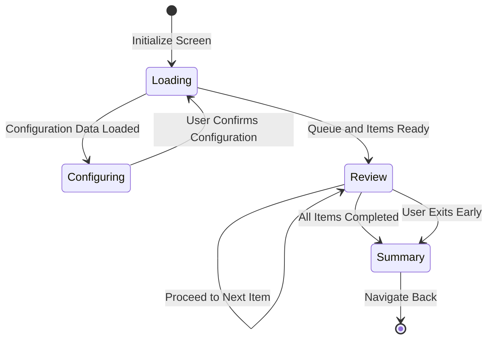

# Navigation Documentation

## Entry Point
The writing practice is initiated via the `MainDestination.LetterPractice` route defined in `MainNavigation.kt`. This destination encapsulates the configuration required to launch a practice session.

```kotlin
@Serializable
data class LetterPractice(
    val configuration: LetterPracticeScreenConfiguration
) : MainDestination {
    override val analyticsName: String = when (configuration.practiceType) {
        ScreenLetterPracticeType.Writing -> "writing_practice"
        ScreenLetterPracticeType.Reading -> "reading_practice"
    }

    @Composable
    override fun Content(state: MainNavigationState) {
        val content = koinInject<LetterPracticeScreenContract.Content>()
        content(
            configuration = configuration, 
            mainNavigationState = state, 
            viewModel = getMultiplatformViewModel()
        )
    }
}
```

## Navigation Flow
The complete flow from user intent to active practice session:

1. **User opens a deck**: Navigates to `DeckDetailsScreen`.
2. **User selects characters**: Initiates practice for a specific group of characters.
3. **DeckDetailsViewModel builds config**: `DeckDetailsViewModel.getPracticeConfiguration()` constructs the `LetterPracticeScreenConfiguration`.
4. **Navigate to Practice**: Invokes `MainNavigationState.navigate(MainDestination.LetterPractice(config))`.
5. **Render Screen**: `LetterPractice.Content()` is triggered, injecting dependencies and rendering `DefaultLetterPracticeScreenContent`.
6. **Initialize ViewModel**: `DefaultLetterPracticeScreenContent` calls `viewModel.initialize(configuration)` to begin loading the session.

## LetterPracticeScreenConfiguration
This class holds the essential data required to initialize the practice screen. It determines if it's a reading or writing session and provides the initial deck of cards.

```kotlin
@Serializable
data class LetterPracticeScreenConfiguration(
    val practiceType: ScreenLetterPracticeType,
    val cards: List<Card>,
) {
    @Serializable
    data class Card(
        val letter: String, 
        val deckId: Long
    ) : PracticeConfigurationCard
}
```

## Screen State Machine
The screen operates on a well-defined state machine to handle the lifecycle of a practice session.



### States
- **Loading**: The transient state during initial data fetching or when transitioning between major states.
- **Configuring**: The pre-practice screen where users can adjust session settings (e.g., shuffle, hint mode, input mode).
- **Review**: The active practice phase where the user interacts with the `CharacterWriter` to draw kanji/kana.
- **Summary**: The post-practice screen displaying results, overall accuracy, session duration, and per-item statistics.

## Navigation Callbacks
`DefaultLetterPracticeScreenContent` manages routing by responding to callbacks from the UI layer:

- `navigateBack`: Executes `mainNavigationState.navigateBack()` to return to the previous screen.
- `navigateToWordFeedback`: Routes to `MainDestination.Feedback` for reporting issues.
- `onWordClick`: Routes to `MainDestination.Info` to show detailed info about a specific word.
- `onSummaryItemClick`: Routes to `MainDestination.Info(InfoScreenData.Letter)` for detailed review of a specific character from the summary.
- `onPracticeCompleted`: Typically calls `navigateBack()` to close the module.

## ScreenLetterPracticeType
An enum defining the type of letter practice, linking to internal data types and preference keys.

```kotlin
enum class ScreenLetterPracticeType {
    Writing(
        dataType = LetterPracticeType.Writing, 
        preferencesType = PreferencesLetterPracticeType.Writing
    ),
    Reading(
        dataType = LetterPracticeType.Reading, 
        preferencesType = PreferencesLetterPracticeType.Reading
    )
}
```
