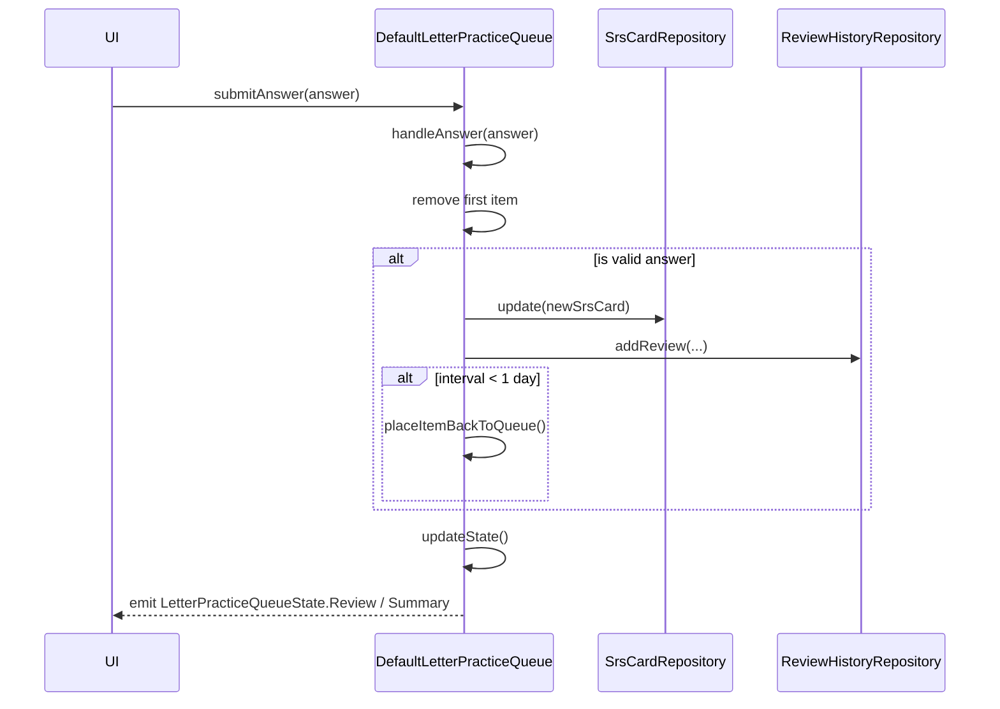

# Practice Queue and SRS Integration

This document explains the practice queue system, its state management, and how it integrates with the Spaced Repetition System (SRS).

## BasePracticeQueue Abstract Base Class

`BasePracticeQueue<State, Descriptor, QueueItem, SummaryItem>` (located in `PracticeQueue.kt`) provides the foundational logic for managing a queue of practice items.

### State Management
* **`MutableStateFlow<State>`**: The queue utilizes a state flow to expose reactive state to the UI.
* **`submittedAnswersChannel`**: A `Channel<PracticeAnswer>` that receives answers from the UI. It applies `debounceFirst()` to prevent rapid, accidental multiple submissions.
* **Timing**: Tracks `practiceStartInstant` and `currentReviewStartInstant` to calculate review duration and overall practice session duration.

### Queue Operations
* **`initialize(items: List<Descriptor>)`**: Takes a list of item descriptors, converts them into internal `QueueItem` instances, and triggers `updateState()` to begin the session.
* **`submitAnswer(answer)`**: Sends an answer to the `submittedAnswersChannel`.
* **`immediateFinish()`**: Forcefully aborts the practice session and transitions to the summary state.
* **`handleAnswer(answer)`**: Processes the submitted answer. It removes the first item from the queue, computes the new SRS state, and places the item back into the queue if the new SRS interval is less than 1 day.
* **`updateState()`**: Retrieves the next item in the queue. It pre-calculates the potential `SrsAnswers` (Again, Hard, Good, Easy), awaits any required asynchronous data, and emits the review state to the UI.
* **`placeItemBackToQueue()`**: When an item needs to be repeated (e.g., incorrect answer), this function repositions it further back in the queue, bounded by `MIN_SHIFT = 3` and `MAX_SHIFT = 10`.

### SRS Integration
* **`SrsScheduler.answers(srsCard, time)`**: Calculates the next SRS intervals and states, returning an `SrsAnswers` object containing the `again`, `hard`, `good`, and `easy` outcomes.
* **`SrsAnswer`**: Each calculated outcome contains the updated `SrsCard`.
* **`SrsCardRepository.update()`**: Persists the newly calculated card state upon answer submission.
* **`ReviewHistoryRepository.addReview()`**: Logs the review event for statistical tracking.
* **`PracticeReviewReporter`**: Reports analytics metrics regarding the practice session.

## DefaultLetterPracticeQueue

`DefaultLetterPracticeQueue` extends `BaseLetterPracticeQueue` (which in turn extends `BasePracticeQueue`).

* **`toQueueItem()`**: Creates an `SrsCardKey`, retrieves an existing `SrsCard` or creates a new one, and wraps it in a `LetterPracticeQueueItem`. It handles lazy, asynchronous loading of character data (like SVG paths).
* **`createSummaryItem()`**: For Writing practice, it extracts the `stroke count` and `mistakes` for the session. For Reading practice, it simply extracts the target letter.
* **`getReviewState()`**: Awaits the loaded data of the current item and returns a `LetterPracticeQueueState.Review`.
* **`getSummaryState()`**: Calculates the total session duration and returns the final summary state.

## SRS Card Keys

The mapping between a specific character and its SRS data is handled by `LetterPracticeType.toSrsKey(character)`. This creates a unique `SrsCardKey` that links the specific character string to the practice modality (Writing vs. Reading).

## PracticeQueueProgress

The UI consumes progress updates through the `PracticeQueueProgress` data class:

```kotlin
data class PracticeQueueProgress(
    val pending: Int,    // items with repeats == 0 (haven't been reviewed yet)
    val repeats: Int,    // items with repeats > 0 (failed and placed back in queue)
    val completed: Int   // summary items with an SRS interval >= 1 day
)
```

## Answer Submission Flow


