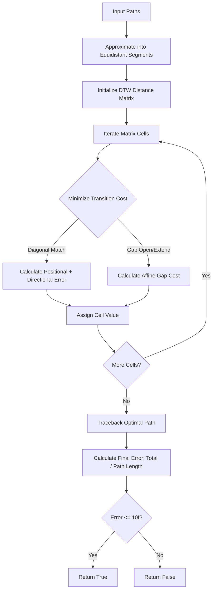

# Stroke Evaluator Engine

The Stroke Evaluator Engine is responsible for comparing a user's drawn stroke path against the canonical SVG path of a character stroke to determine if it is correct.

## `KanjiStrokeEvaluator` Interface

The core interface defining stroke evaluation logic.

```kotlin
interface KanjiStrokeEvaluator {
    fun areStrokesSimilar(first: Path, second: Path): Boolean
}
```

## `DefaultKanjiStrokeEvaluator`

A fast, heuristic-based evaluator comparing simplified path representations.

**Constants:**
* `SIMILARITY_ERROR_THRESHOLD = 100f`
* `INTERPOLATION_POINTS = 22`
* `MIN_SCALE_DIMENSION = 1f`

**Algorithm (Step-by-Step):**
1. **Approximation:** Approximate both the canonical path (`first`) and the user's path (`second`) evenly with 22 points using `PathApproximation.approximateEvenly`.
2. **Length Error:** Calculate the length difference error: `20 * |len1 - len2| / KanjiSize`.
3. **Center Error:** Calculate the center difference error: `2 * euclideanDistance(center1, center2)`.
4. **Centering:** Center both sets of points around the origin `(0,0)` by subtracting their respective centroids.
5. **Scale Error:** Calculate the relative bounding box scale ratio (`widthRatio`, `heightRatio`). Calculate scale error: `5 * (widthRatio + heightRatio)`.
6. **Scaling:** Scale the points of the canonical path to match the bounding box scale of the user's path.
7. **Pointwise Error:** Calculate the pointwise distance error between the two adjusted point sets: `0.2 * sum(distances)`.
8. **Final Result:** Sum the length, center, scale, and pointwise errors. If the total is `<= 100f`, the strokes are considered similar.

## `AltKanjiStrokeEvaluator` (DTW-based)

An alternative evaluator using Dynamic Time Warping (DTW) for more robust, orientation-aware matching.

**Constants:**
* `DIFFICULTY = 1.0f`, `SIMILARITY_ERROR_THRESHOLD = 10f`
* `SEGMENT_LENGTH = 5f`, `POSITIONAL_DEAD_BAND = 44f`
* `DIRECTIONAL_DEAD_BAND = 5f` degrees
* `GAP_OPENING = 5f`, `GAP_EXTENSION = 5f`
* `MAX_POSITIONAL_ERROR = 6f`, `MAX_DIRECTIONAL_ERROR = 30f`
* `ERROR_SCALE = 20f`

**Algorithm:**
1. **Approximation:** Approximate both paths into equidistant segments of length 5 using `PathApproximation.approximateEquidistant`.
2. **Matrix Initialization:** Build a DTW distance matrix where each element represents a `Vector2d` containing both positional and directional components of the stroke segments.
3. **Cell Calculation:** For each cell in the matrix, minimize the cost over three possible transitions: row-gap, column-gap, and diagonal match.
4. **Diagonal Match Cost:** Combines average positional error and directional error between the two segments.
5. **Gap Costs:** Uses an affine gap penalty: `GAP_OPENING + GAP_EXTENSION * length²`.
6. **Positional Error:** Calculated by subtracting `POSITIONAL_DEAD_BAND`, applying a power of 2.5, capping at 1.0, and scaling by `ERROR_SCALE`.
7. **Directional Error:** Uses an `atan2` rotation trick to find the shortest angular difference, subtracts `DIRECTIONAL_DEAD_BAND`, caps the value, and scales it.
8. **Traceback:** Traces the optimal path back through the matrix to find the total alignment path length.
9. **Final Result:** `Final error = matrix[last][last] / pathLength`. The strokes are considered similar if the final error is `<= 10f`.

### DTW Evaluation Flowchart



## Path Approximation Utilities

The `PathApproximation` utility object provides functions for extracting points from Android vector paths.

* **`approximateEvenly(points: Int)`**: Samples a path to produce exactly the requested number of points, evenly spaced along its length. Returns `PathApproximation.Success(pointsList, totalLength)`.
* **`approximateEquidistant(segmentLength: Float)`**: Samples a path such that every segment between points has an exact, fixed length. Useful for DTW.
* **Helper Functions**: Includes mathematical utilities for matrix operations: `center()`, `decreaseAll()`, `relativeScale()`, `scaled()`, and `euclDistance()`.
