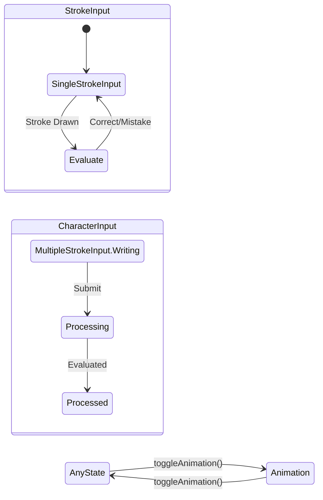

# Character Writer State Machine

The Character Writer subsystem governs the interactive canvas where users draw characters. It manages input modes, stroke evaluation state, animations, and rendering.

## `CharacterWriterState` Interface

The public API for the character writer state.

```kotlin
interface CharacterWriterState {
    val character: String
    val strokes: List<Path>
    val configuration: CharacterWriterConfiguration
    val content: State<CharacterWriterContent>
    val progress: State<CharacterWritingProgress>
    
    fun submit(inputData: CharacterInputData)
    fun toggleAnimationState()
}
```

## Configuration Modes

The writer operates under different configuration modes defined in `CharacterWriterConfiguration`:
* **`StrokeInput(isStudyMode: Boolean)`**: The user draws the character one stroke at a time. The system evaluates each stroke individually.
* **`CharacterInput`**: The user draws the entire character freely. The system evaluates all strokes simultaneously only after the user submits.

## Content State Machine

The visual content of the writer transitions through various states based on user interaction.



## Input Processing

### `SingleStrokeInput` Processing
1. User draws a stroke on the canvas.
2. The `StrokeInput` composable captures the touch events via `detectDragGestures`.
3. Touch coordinates are scaled from the physical screen space to the standard `KanjiSize` coordinate space (109x109).
4. Submits data: `CharacterWriter.submit(CharacterInputData.SingleStroke(userPath, kanjiPath))`.
5. `DefaultCharacterWriterState.handleSingleStrokeInput()` processes the stroke:
   * Calls `strokeEvaluator.areStrokesSimilar(kanjiPath, userPath)` on the IO dispatcher.
   * **If correct**: Increments `drawnStrokesCount` and emits `StrokeProcessingResult.Correct`.
   * **If wrong**: Increments `currentStrokeMistakes` and `totalMistakes`.
     * If mistakes > 2 for the *current* stroke, it reveals the correct stroke as a hint.
     * Otherwise, it briefly displays the user's stroke in an error color.
   * Emits the result via the `inputProcessingResults` SharedFlow.

### `MultipleStrokeInput` Processing
1. User draws multiple strokes freely on the canvas.
2. User presses the UI submit button.
3. Submits data: `CharacterWriter.submit(CharacterInputData.MultipleStrokes)`.
4. State transitions: `Writing` → `Processing` → `Processed`.
5. During `Processing`, the evaluator compares each drawn stroke against the expected strokes (or marks unpaired strokes). Each stroke pair is marked as `Correct` or `Mistake`.
6. Transitioning to `Processed` triggers a `lerpTo` animation that physically morphs the user's drawn paths into the canonical correct paths.

## Writing Progress Derivation

The overall progress of the writing session is derived from the current state:

```kotlin
SingleStrokeInput: drawnStrokesCount == strokes.size → Completed.Idle
MultipleStrokeInput.Processed → Completed.Idle
Animation → Completed.Animating
Otherwise → Writing
```

## Correctness Threshold

The final outcome of a practice session is determined by the total number of mistakes allowed based on the character's complexity (stroke count).

```kotlin
fun isResultCorrect(mistakes: Int): Boolean = when (strokes.size) {
    1 -> mistakes == 0
    2, 3 -> mistakes < 2
    else -> mistakes <= 2
}
```

## Study Mode vs Review Mode

The writer architecture uses a dual-state pattern to handle study sessions cleanly:
* **`studyWriterState`**: Created with `StrokeInput(isStudyMode = true)`. Initialized only if `shouldStudy` is true and it's the `firstRepeat` of the session.
* **`reviewWriterState`**: Created with either `StrokeInput(isStudyMode = false)` or `CharacterInput`, depending on user preferences.
* **`isStudyMode`**: A `MutableState<Boolean>` that toggles which underlying state is active.
* **`writerState`**: A `derivedStateOf` that returns the currently active writer state (`studyWriterState` or `reviewWriterState`).

## Canvas Rendering Pipeline

The rendering pipeline dictates how the composables stack to build the canvas UI.

1. **`CharacterWriter(state, modifier, brushSettings)`**: The root composable.
2. Resolves content state: → `SingleStrokeInputContent` OR `MultipleStrokeInputContent` OR `AnimatedCharacter`.
3. Inside **`SingleStrokeInputContent`**:
   * `Kanji(strokes.take(drawnCount))` — Draws previously completed strokes in the base color.
   * `StudyStroke` or `HintStroke` — Shows the next expected stroke (animated or faded).
   * `MistakeStroke` — Flashes incorrectly drawn strokes.
   * `StrokeInput` — The transparent overlay capturing user touch gestures.
4. **`BrushSettings`**: Configures the `Stroke` properties applied to paths, such as stroke width, cap (`StrokeCap.Round`), join (`StrokeJoin.Round`), and alpha.

## `KanjiSize` Constant

All canonical SVG stroke paths are defined in a standardized `109x109` coordinate space (`KanjiSize = 109f`). The canvas automatically scales these canonical coordinates to fit the actual physical screen dimensions of the device, ensuring consistent evaluation regardless of screen density or aspect ratio.
